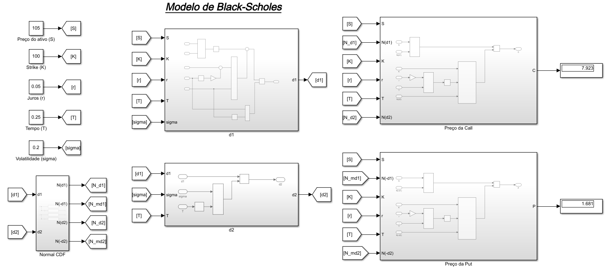

# Black-Scholes Option Pricing Model in Simulink

This directory contains a modular implementation of the Black-Scholes-Merton analytical model for pricing European options using MATLAB/Simulink. 

The model leverages a systems engineering approach, utilizing subsystems to encapsulate intermediate calculations, making the architecture scalable and easy to debug.

## Mathematical Framework

The Simulink blocks directly map to the closed-form Black-Scholes formulas for European Call ($C$) and Put ($P$) options:

$$C = S \cdot N(d_1) - K \cdot e^{-rT} \cdot N(d_2)$$
$$P = K \cdot e^{-rT} \cdot N(-d_2) - S \cdot N(-d_1)$$

Where the intermediate variables $d_1$ and $d_2$ are calculated as:

$$d_1 = \frac{\ln(S/K) + (r + \sigma^2 / 2)T}{\sigma \sqrt{T}}$$
$$d_2 = d_1 - \sigma \sqrt{T}$$

## Simulink Architecture

Below is the block diagram of the implementation:

### Model Components:
* **Inputs Variables:** The model takes real-time or static inputs for Asset Price ($S$), Strike Price ($K$), Risk-free Rate ($r$), Time to Maturity ($T$), and Volatility ($\sigma$).
* **Calculation Subsystems:** Distinct blocks are dedicated to computing $d_1$, $d_2$, and the Normal Cumulative Distribution Function ($N(x)$).
* **Pricing Outputs:** The final subsystems compute the option premiums. In the test case provided in the diagram ($S = 105$, $K = 100$, $r = 5\%$, $T = 0.25$, $\sigma = 20\%$), the model correctly outputs a Call price of $7.923$ and a Put price of $1.681$.

## Usage
1. Open `black_scholes_model.slx` in MATLAB/Simulink.
2. Modify the input constants or connect them to a dynamic data feed.
3. Run the simulation to output the continuous pricing data.
