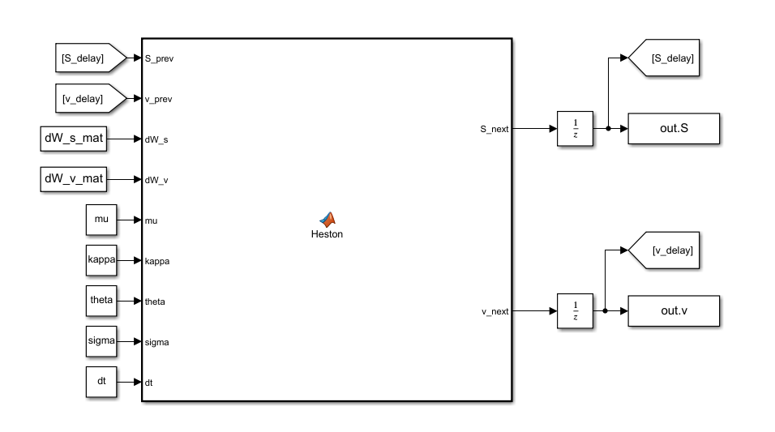
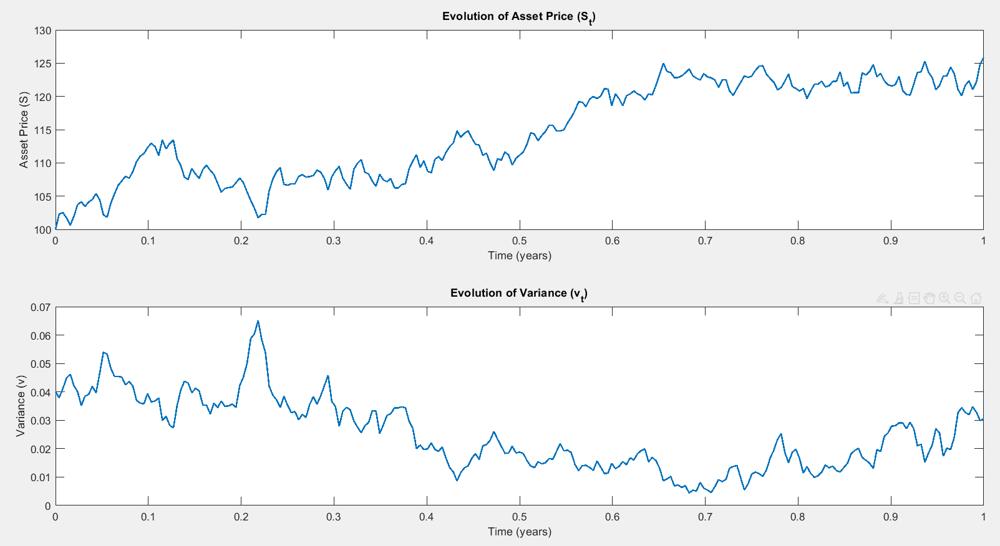

# Heston Stochastic Volatility Model in Simulink

This directory contains a discrete-time implementation of the Heston stochastic volatility model using MATLAB and Simulink. 

Unlike the Black-Scholes model, which assumes constant volatility, the Heston model acknowledges that volatility itself is a random process that tends to revert to a long-term mean.

## Mathematical Framework

The model simulates the following coupled Stochastic Differential Equations (SDEs) for the asset price ($S_t$) and its variance ($v_t$):

$$dS_t = \mu S_t dt + \sqrt{v_t} S_t dW_t^S$$
$$dv_t = \kappa(\theta - v_t)dt + \sigma \sqrt{v_t} dW_t^v$$

Where the two Wiener processes (Brownian motions) are correlated:
$$dW_t^S dW_t^v = \rho dt$$

* $\mu$: Expected return (drift)
* $\kappa$: Mean reversion speed
* $\theta$: Long-term variance
* $\sigma$: Volatility of variance (vol of vol)
* $\rho$: Correlation coefficient (typically negative in equity markets to capture the leverage effect)

## Simulink Architecture

The system utilizes a discrete-time solver approach (`FixedStepDiscrete`). The stochastic updates are processed within a MATLAB Function block, and unit delays (`1/z`) are applied to feed the state variables ($S_{t-1}$ and $v_{t-1}$) back into the current time step calculation, effectively performing an Euler-Maruyama discretization.

## Simulation Results

The initialization script (`init_heston.m`) generates the correlated noise matrices and drives the Simulink model. The output demonstrates the stochastic trajectory of the asset price alongside the mean-reverting behavior of its variance over a one-year horizon (252 trading days).

## Usage
1. Open `matlab_function_heston.slx` in Simulink.
2. Run the `init_heston.m` script. This will populate the workspace with the necessary parameters, generate the correlated Brownian motions, execute the Simulink model, and plot the resulting paths.
